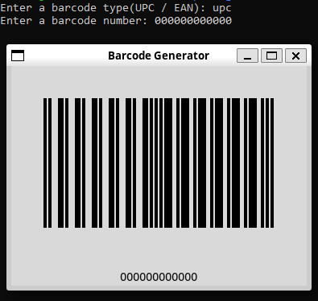

# Barcode

* Python library for converting decimal numbers into barcodes using Tkinter python library
* Made for fun and to better understand barcodes and the TKinter python library
* Currently only UPC type barcodes are supported

## Example

